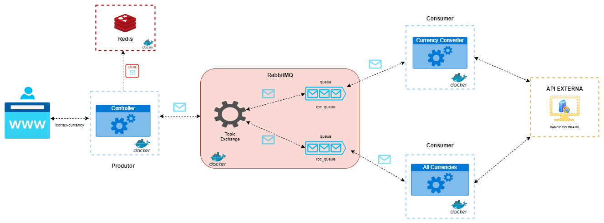

# Cortex Recruiting - Lucas Wilker

Backend Desenvolvido em **SPRING BOOT** juntamento com **REDIS** e **RABBITMQ**

### Algumas informações 

#### Problema base:
- Fazer uma conversão de moeda (p.ex. *USD* para *EUR*) a partir de base nos dados do Banco Central do Brasil;
- Um dos requisitos é que a aplicação saiba lidar com *cache* e *TTL*;
- Deve existir um *sistema de filas* para lidar com os processos da aplicação

### Explicando Arquitetura Construída:



- A arquitetura foi baseada em microserviços, onde faço o uso de containers docker para gerir minhas aplicações- O projeto está dividido em *Produtor* e *Consumidor*


| Tecnologias   | Motivo do uso                                                                                                                                                                                                                                             | 
|---------------|-----------------------------------------------------------------------------------------------------------------------------------------------------------------------------------------------------------------------------------------------------------|
| *Spring Boot* | Sou suspeito pra falar, mas sou amante de Java :)                                                                                                                                                                                                         |
| *Redis*       | Sistema de *Cache*. Prefiri utilizar um banco de dados relacional de alto desempenho por se tratar de basicamente de uma busca de dados em uma api externa e exibi-los. Dessa forma, para a versatilidade e velocidade por recuperação de dados em memória |                                                                                                                                                        |
| *RabbitMQ*    | Por se tratava de uma aplicação baseada em Microserviços. O serviço de mensageria vem a calhar por se tratar de um cenário com poucas quantidades de requisições para a api externa e sem foco de armazenar grande quantidade de dados                    |
| *Docker*      | Estruturação em cache multistaged com multi modulos. O Produto e Consumidor depende de outro módulo - librabbitmq - dessa forma utilizei dessa forma.                                                                                                     |
| *Api BCB*     | Api Externa. Endpoint utilizado `/CotacaoMoedaPeriodo(moeda=@moeda,dataInicial=@dataInicial,dataFinalCotacao=@dataFinalCotacao)`                                                                                                                |
- Nessa arquitetura, o objeto é fazer com que quando chegue uma request para o endpoint `/cotacaomoedacortex/conversao` a 
primeira porta de entrada receba-a, dessa forma consiga passar para qual fila será redirecinada deixando o *Exchange* do rabbitmq fazer seu trabalho para rotear
o microserviço. Quando essa mensagem bater em um determinado microserviço, ele executar sua ação consultando a api externa do *BCB*. Nessa arquitetura, temos dois pontos:
  - Converter a moeda com o valor desejado
  - Consultar todas as moedas suportadas pela api do *BCB* `não implementado :(`

- Quando a API retornar seus dados, é selecionado uma fila rpc.reply para voltar a mensagem para o cliente
- Nesse ponto, o *Redis* entra em ação e faz com que esse dado retornado do microserviço seja armazenado em cache.


### Organização do código:
- A arquitetura foi baseada em microserviços, onde faço o uso de containers docker para gerir minhas aplicações
- O projeto está dividido em *Produtor* e *Consumidor*
- Foi seguido estrutura MVC
- Multistage do docker é feito em cima do modulo principal
- Cada módulo tem seu respectivo `Dockerfile` e é utilizando no `docker-compose` raiz
- Para o reuso e transição de objetos DTO, foi criado a *librabbitmq* e reutilizado no *Produtor* e *Consumidor*

### Estrutura de commits:
A ideia inicial do meu Git Flow é seguir uma granularização simples e efetiva
- classe principal: *main*
- a partir dela: *develop*
- A partir da *develop*:
  - *producer-converter*
  - *consumer-converter*

desenvolvido cada módulo da aplicação e quando finalizada, *merjada* para a develop.

### Pontos de melhoras:
- Tratar as exceções dos objetos transientes json providos da API BCB. Às vezes a api externa do BCB pode ficar indisponível
- Exceções mais rebuscadas do AMQP. Quando o processamento de uma fila é derrubada, pode ser que aconteça reprocessamento da fila sem interrupcções
- Implementar um segunda fila para o microserviço que consulta todas as moedas disponíveis `questão de tempo :)`
- Cache distruido caso a aplicação crescesse muito e rapidamente escalar com o Redis
- Reduzir - ainda mais - o tamanho das imagens geradas das aplicações no docker


### Instalação


*Requisitos:*

- [Docker](https://docs.docker.com/get-docker/)
- Consultar [Api BCB](https://dadosabertos.bcb.gov.br/dataset/taxas-de-cambio-todos-os-boletins-diarios) para verificar moedas utilizadas
```
curl -X GET "https://olinda.bcb.gov.br/olinda/servico/PTAX/versao/v1/odata/Moedas?%24format=json"
```

### Rodar Aplicação:

```sh
$ docker compose up
```